# Steamwork 思维导图

## 颜色说明

- 蓝色：已有内容
- 绿色：核心玩法定位
- 橙色：下一阶段机器线
- 黄色：装置与工具线
- 粉色：新鲜机制候选
- 紫色：终局目标与自动化
- 灰色：联动方向

```mermaid
flowchart TB
  root["Steamwork 蒸汽工坊"]

  existing["已有内容"]
  core["核心定位"]
  next["后续机器线"]
  devices["装置与工具线"]
  novelty["新鲜机制候选"]
  endgame["终局倒推"]
  link["Pylon / 柴油联动"]

  root --> existing
  root --> core
  root --> next
  root --> devices
  root --> novelty
  root --> endgame
  root --> link

  existing --> e1["锅炉 / 蒸汽 / 热源"]
  existing --> e2["洗选槽 / 浸煮桶 / 灭菌箱"]
  existing --> e3["加压炉 / 高压合金"]
  existing --> e4["蒸汽涡轮 / 蒸汽动力臂"]
  existing --> e5["黄铜组件 / 密封件 / 加热线圈"]

  core --> c1["蒸汽负责工艺"]
  core --> c2["柴油负责动力"]
  core --> c3["蒸汽不是万能能源"]
  core --> c4["从 Pylon 中期接入"]

  c1 --> c11["加热 / 加压 / 洗选 / 灭菌 / 冷凝"]
  c2 --> c21["高速 / 稳定 / 长时间自动化"]

  next --> n1["纯蒸汽机器"]
  next --> n2["蒸汽辅助柴油机器"]
  next --> n3["汽凝级混合机器"]

  n1 --> n11["蒸汽冲压机"]
  n1 --> n12["蒸汽卷管机"]
  n1 --> n13["蒸汽研磨机"]
  n1 --> n14["蒸汽离心机"]
  n2 --> n21["柴油高压冲压机"]
  n2 --> n22["柴油矿浆泵"]
  n2 --> n23["柴油离心机"]
  n2 --> n24["柴油冷凝塔"]
  n3 --> n31["复合动力机械臂"]
  n3 --> n32["汽凝深层采矿机"]
  n3 --> n33["汽凝涡轮"]

  devices --> d1["物流装置"]
  devices --> d2["世界交互装置"]
  devices --> d3["农业装置"]
  devices --> d4["玩家工具"]
  devices --> d5["红石/状态装置"]

  d1 --> d11["蒸汽机械臂"]
  d1 --> d12["蒸汽转运管夹"]
  d1 --> d13["蒸汽分拣阀"]
  d1 --> d14["蒸汽投送器"]
  d2 --> d21["蒸汽装载台"]
  d2 --> d22["蒸汽起重钩"]
  d3 --> d31["蒸汽采集臂"]
  d3 --> d32["蒸汽播种器"]
  d4 --> d41["蒸汽扳手"]
  d4 --> d42["蒸汽压路锤"]
  d5 --> d51["蒸汽信号继动器"]
  d5 --> d52["蒸汽压力表"]

  novelty --> v1["压力脉冲网络"]
  novelty --> v2["蒸汽记忆盘"]
  novelty --> v3["冷凝标记器"]
  novelty --> v4["气压邮筒"]
  novelty --> v5["蒸汽共振器"]
  novelty --> v6["汽凝裂隙"]

  v1 --> v11["频率决定机器模式"]
  v2 --> v21["复制装置配置"]
  v3 --> v31["物品获得临时工艺状态"]
  v4 --> v41["绑定点之间传送小批量物品"]
  v5 --> v51["机器节奏同步获得效率"]
  v6 --> v61["终局特殊反应环境"]

  endgame --> g0["最终目标：汽凝晶核"]
  g0 --> g1["深层矿浆"]
  g0 --> g2["富矿冷凝液"]
  g0 --> g3["稳定汽凝胚"]
  g0 --> g4["钯金催化框架"]
  g0 --> g5["钨 / 因瓦 / 锰青铜组件"]

  g1 --> a1["深层矿浆泵自动获取"]
  g2 --> a2["冷凝塔加工"]
  g3 --> a3["高压反应釜合成"]
  g4 --> a4["接入 Pylon 钯金终局"]

  link --> l1["Pylon 提供钢 / 青铜 / 冶炼 / 钯金"]
  link --> l2["Steamwork 提供湿法处理 / 高压合金"]
  link --> l3["柴油机器承担规模化生产"]
  link --> l4["终局后反向升级蒸汽和柴油机器"]

  classDef existing fill:#d8ecff,stroke:#3f7fbf,color:#123;
  classDef core fill:#dff6df,stroke:#4b9b4b,color:#132;
  classDef next fill:#ffe7c2,stroke:#d08322,color:#321;
  classDef devices fill:#fff4b8,stroke:#c79a16,color:#321;
  classDef novelty fill:#ffdce8,stroke:#c75a7a,color:#312;
  classDef endgame fill:#eadcff,stroke:#7d59c7,color:#213;
  classDef link fill:#eeeeee,stroke:#777,color:#222;
  classDef root fill:#f8f8f8,stroke:#333,stroke-width:2px,color:#111;

  class root root;
  class existing,e1,e2,e3,e4,e5 existing;
  class core,c1,c2,c3,c4,c11,c21 core;
  class next,n1,n2,n3,n11,n12,n13,n14,n21,n22,n23,n24,n31,n32,n33 next;
  class devices,d1,d2,d3,d4,d5,d11,d12,d13,d14,d21,d22,d31,d32,d41,d42,d51,d52 devices;
  class novelty,v1,v2,v3,v4,v5,v6,v11,v21,v31,v41,v51,v61 novelty;
  class endgame,g0,g1,g2,g3,g4,g5,a1,a2,a3,a4 endgame;
  class link,l1,l2,l3,l4 link;
```

## 一句话路线

从 Pylon 中期接入，用蒸汽做加热、加压、洗选、灭菌和冷凝，用柴油承担高速和规模化生产，最终通过深层矿浆、富矿冷凝液、钯金催化框架和高压合金组件做出汽凝晶核，再反过来解锁更强的自动化机器。

## 设计锚点

- Steamwork 不做从零开始的基础科技线，而是从 Pylon 青铜、钢、流体和冶炼体系之后展开。
- 蒸汽机器偏工艺处理，适合湿法资源、树脂、生物质、矿浆和高压合金。
- 柴油机器偏持续动力，适合泵、离心、钻探、冷凝塔循环和长期自动化。
- 汽凝晶核是 Steamwork 的毕业目标，但它应继续解锁自动化，而不是只作为收藏品。

## 当前基础机器定位

- 蒸汽浸煮桶：处理植物、木材、根系和树脂来源，产出植物纤维、蒸汽纸浆、粗树脂、处理木材和纤维板。
- 蒸汽洗选槽：处理砂砾、砂、岩石和原矿，产出锌精矿、二氧化硅砂、矿物助熔剂，并给 Pylon 原矿提供湿法增产。
- 蒸汽灭菌箱：处理腐肉、骨、菌类、苔藓、树脂和纤维，产出无菌生质、无菌培养基、硫化橡胶、覆胶织物和橡胶垫圈。
- 三台机器共同服务黄铜机械组件、高压合金、锅炉升级和后续深层矿浆线。
